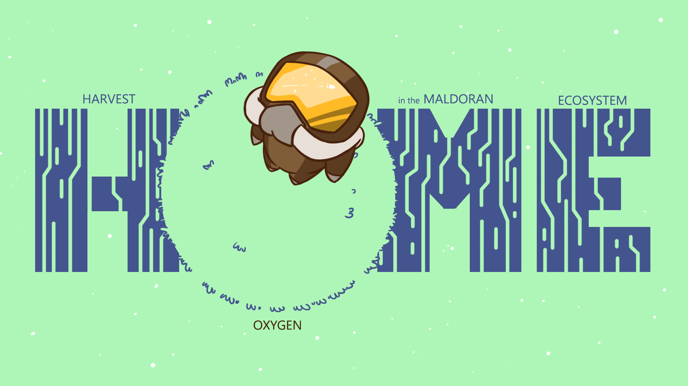

# Harvest Oxygen in the Maldoran Ecosystem

Global Game Jam 2019

You crash on a unexplored planet, called Maldoran, you have to harvest oxygen to survive, metal and energy to repair your ship to be able to go home finally.

## Required libraries

- GF (https://github.com/GamedevFramework/gf)

- SFML-AUDIO

- Box2D

## Build & run
```
git clone https://github.com/Hatunruna/ggj19.git
cd ggj19
mkdir build
cd build
cmake ..
make install (require superuser access)
```

# Run the client:
```
./home
```
